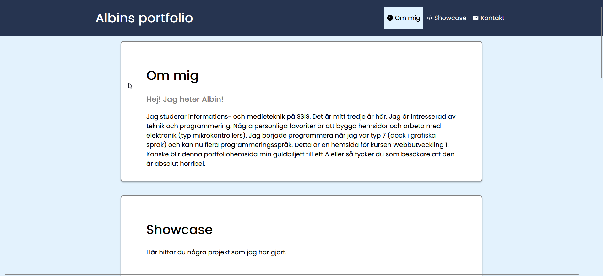

# Portfolio-hemsida

Detta är en portfoliohemsida som jag skapade som projekt i kursen Webbutveckling 1.
Hemsidan är en personlig hemsida med HTML, CSS och JavaScript. Du kan hitta hemsidan [här](https://20alse.ssis.nu/portfolio).

### Dokumentation

Det finns dokumentation på sidan i mappen [dokumentation](dokumentation). **Viktigt!** Eftersom instruktionerna att skapa ett repository kom efter att jag i princip hade löst alla problem på hemsidan så har jag inte använt Issues för att skriva om problemen, utan jag har skrivit om de i dokumentationen istället.

### Extra

Denna repository laddar automatiskt upp ändringar till https://20alse.ssis.nu/portfolio via SFTP genom att använda sig av [GitLab CI/CD](https://git.ssis.nu/20alse/portfoliohemsida/-/pipelines). Helt överkurs, men en kul och smidig extragrej!