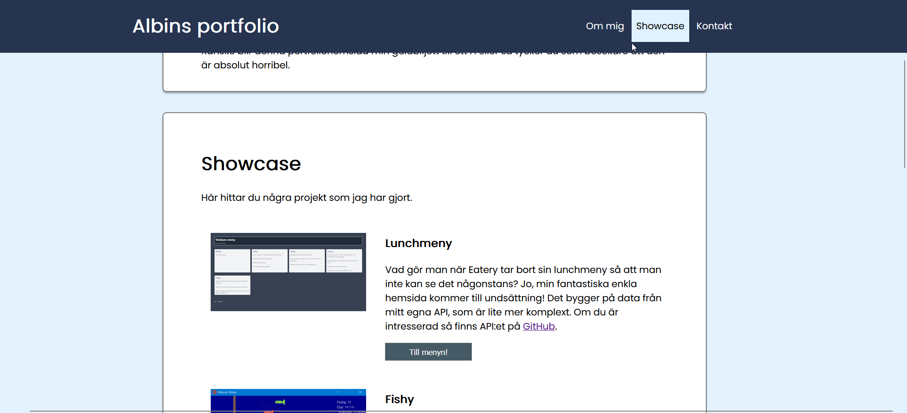
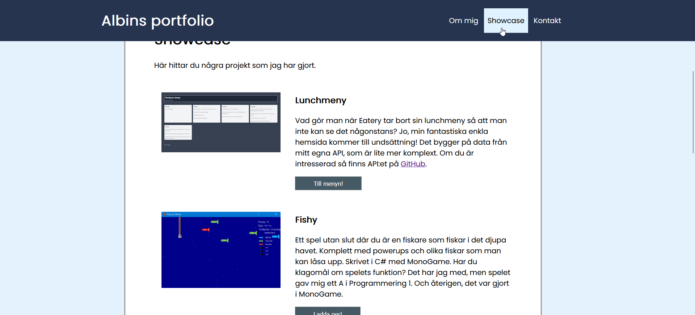

# Dokumentation

## Hemsidans design

**Om hemsidan/huvudsaklig tankegång**

Jag valde att göra min hemsida som en "single-page-website", alltså en hemsida där allt innehåll finns i samma HTML-fil. Länkar man klickar på i menyn skrollar på den individuella sidan snarare än länkar till en annan sida. Detta valde jag eftersom jag inspirerades av modernare portfoliohemsidor där man oftast valt att ha allt på samma sida. Utöver att det är modernt så vissa sektioner inom hemsidan ganska korta (har ganska lite innehåll), till exempel kontaktsidan. Att lägga detta på en egen sida skulle skapa en sida som ser väldigt tom ut.

## Hemsidans kodstruktur

#### Innehållsformatetring

Om man tittar från toppen av HTML-filen så är min hemsida uppdelad i dess huvudsakliga delar:

- `header`: Visar en rubrik på sidan samt en meny man kan använda för att navigera runt.
- `about-me`: Visar information om mig.
- `project-showcase`: Visar projekt jag har gjort.
- `contact`: Visar hur man kan kontakta mig

**Innehållsdelar**

Stilistiskt sätt så är varje del som ett eget "block". Varje innehållsdel (alla delar ovan förutom `header`) använder samma CSS-klass, `content-wrapper`, för att få ett enhetligt utseende. Med en `content-wrapper` avses en box med rundade hörn som har vit bakgrund. För att slippa repetera kod kan man generalisera den med CSS-klasser, vilket var därför jag valde att använda det.
Förutom detta kan man också se att jag har osynliga länkar vid varje `content-wrapper`, t.ex.

```html
<a name="anchor" data-for="contact">&nbsp;</a>
```

Mer om detta senare. (det är en del av skrollningsfunktionen)

**Projekt**

För `project-showcase`-diven har jag lagt till en till klass, som heter `project`. Ett `project` avser något projekt jag har gjort. Jag lade till denna klass för att jag ville ha specifika stilar för projekt, t.ex. ha en bild bredvid texten (och se till att denna bild skalas korrekt).

**Kontakt**

Nämnvärt här är att jag använder två ikoner: en ikon för mail och en för Discord. Dessa ikoner renderar jag genom att använda ett verktyg som heter [Iconify](https://iconify.design) som låter en använda ikoner från väldigt många populära ikonpaket på en hemsida. Den lägger till taggen `iconify-icon` som jag använder. Denna renderas automatiskt när hemsidan laddas till en svg-ikon som man kan se koden för om man inspekterar sidan.

#### Kod (JavaScript)

Jag använder JavaScript för att menyn på hemsidan som har knappar för att indikera det aktuella innehållsblocket man är på ska uppdateras när man skrollar på sidan. Om man skrollar på min hemsida utan att klicka någonstans i menyn så upptäcker man ändå att knapparna uppdateras dynamiskt.

Här behövde jag på något sätt spåra hur användaren skrollar. Detta gjorde jag genom att placera ut osynliga länkar på hemsidan för att kolla om man har skrollat förbi de. Taggarna har följande format:

```html
<a name="anchor" data-for="about-me">&nbsp;</a>
```

`name` är för att jag i JavaScript enkelt ska kunna hämta alla hemliga länkar med `document.getElementsByName`. `data-for` är ett sk. data-attribut som man också kan läsa med JavaScript. Här lägger jag in vilket ID den content-wrapper som man spårar har. T.ex. exemplet ovan anger att `<a>`-taggen hör till `about-me`. På så sätt vet jag vilka boxar man har skrollat förbi eller inte och kan använda det för att uppdatera knapparna i min kod.

För att hantera manuella klick så använder jag också data-attribut som jag nyss nämnde. Om man tittar på varje del i menyn så ser den ut så här:

```html
<a class="menu-item" onClick="handleMenuClick(this)" data-controls="about-me"
  >Om mig</a
>
```

`data-controls`-attributet säger vilken content-wrapper som knappen hör till så min kod vet vart den ska skrolla.
Skrollningen i sin tur sköts av en javascript-funktion som heter `handleMenuClick`. Inuti den så använder jag en fin funktion som jag hittade i JavaScript som heter `scrollIntoView`. Dock var detta inte helt smärtfritt (se proble och lösningar nedan)

## Problem under processen och lösningar

Här är en lista på några problem jag stötte på när jag utvecklade min hemsida och hur jag löste de.

**"Scrollspy"-menyn**

Eftersom jag ville bygga min hemsida som en "single page"-hemsida (där allt innehåll finns på samma sida ville jag ha en meny med knappar för att kunna skrolla till olika delar på sidan. Så långt är det inga konstigheter, men eftersom knapparna används som visuella indikatorer som visar vart någonstants man är på sidan så behövde jag lösa att de uppdaterades varje gång användaren skrollade förbi de. Jag förklarade hur jag löste det ovan, men det fanns ett problem: i och med att jag använde en `sticky` positionering för min header (så att den alltid är längst upp på sidan) och `grid` för att styla mina projekt så är inte Javascript-funktionen `scrollIntoView` tillräckligt smart för att skrolla till rätt ställe, vilket är väldigt irriterande. Jag löste detta genom att manuellt lägga in en förskjutning för varje element vilket fanns som en CSS-attribute: `scroll-margin-top`, som då applicerar en extra margin på varje element när man skrollar till det.


_Skrollning vid klick på "Showcase" med `scroll-margin-top` implementerat_.


_Skrollning vid klick på "Showcase" utan `scroll-margin-top` implementerat_.

**Projektlådor**

För mina "projektlådor" på sidan så ville jag ha följande layout:


För att åstadkomma detta behövde jag använda någon form av dynamisk positionering. Jag bestämde mig för att använda `grid` eftersom jag redan visste att jag ville att innehållet skulle disponeras med hjälp av procent (se skärmdump). Detta är enkelt att göra i grid då man har ett CSS-attribut som heter `grid-template-columns` där man kan definiera hur kolumnerna ska disponeras på ett intuitivt sätt:

```css
grid-template-columns: 33.33% auto;
```

`auto` ovan är för att texten ska fylla så mycket som den kan fylla, vilket teoretiskt sett nästan alltid kommer vara 2/3 av sidan.
